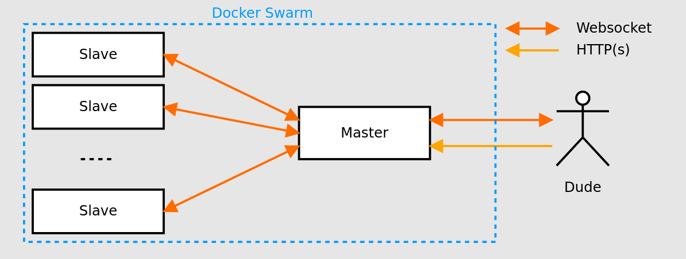

# Docker md5 force

## Présentation du TP

Votre infrastructure devra pouvoir répondre à des résolutions de hash md5. Si la charge de travail (monitorer) devient trop importante, des containers devront être créer. Et inversement.

Il y a donc des serveurs en écoute (scalabilité), un container capable de changer la scalabilité, et éventuellement une base de données capable de stocker les hash réussi (Mongo).



Une petite appli capable d'envoyer des requètes (WebSocket) vers cette infra. Une petite interface utilisateur permettant de choisir des modes gentils, normals, agressifs est requise.

Le plus, serait d'avoir le monitoring plus ou moins (5 - 10 secondes) de l'infrastructure (idem par HTTP ou WebSocket par exemple).

## Outils

### Client web

Le client web est réalisé en react. Il permet à l'utilisateur de :
- Ajouter des slaves
- Supprimer des slaves
- Donner les hashs à résoudre
- Avoir les logs sur les hashs trouvé et les hash en cours de résolution

### Base de données

Comme base de données nous utilisons mongodb. Elle nous permet de sauvegarder les hashs déjà résolu. Lorqu'un utilisateur recherche un hash, le service va vérifier si il existe dans la base de données et si il n'est pas présent il l'envoi aux slaves.

### Server websocket

Nous avons un server websocket comme master qui permet de faire le lien entre les slaves, le client web et la base de données.

Le serveur ce trouve dans ```src/server.js```

Dans le serveur websocket les clients sont regroupés en deux catégories :
- les slaves
- les pages web

Lorqu'un slave rejoint le réseau websocket il est ajouté en tant que slave. Et lorsqu'une personne se connecte sur la page client ```http://localhost:3000``` le client websocket est reconnu en tant que client.

### Docker

Nous avons utilisé le docker slave d'un autre élève : https://hub.docker.com/r/itytophile/hash-slave

Nous avons un docker-compose qui nous permet de démarrer le client web qui se situe dans un dockerfile, un mongdb et les slaves avec un réplicat à 0.

Le dockerfile permet de démarrer une image node. D'installer npm, docker et docker-compose. Npm permet d'exécuter la commande pour démarrer le server web en react. et docker permet d'exécuter la commande ```docker-compose up -d --no-recreate --scale slave={nb slave}``` qui permet de augmenter et réduire le nombre de slave.

## installation

1. docker-compose up --build